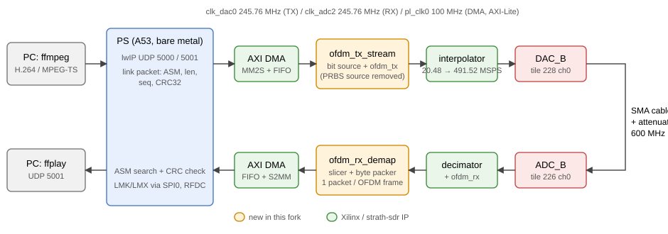
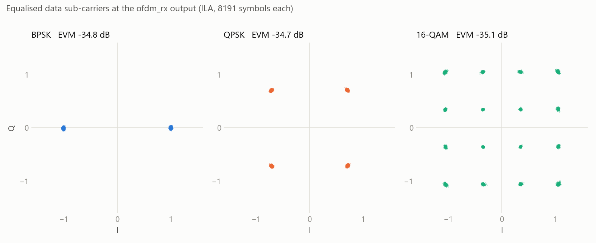
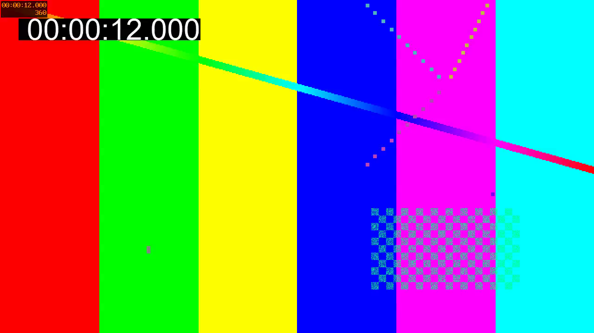

-9A90FD.svg)   

[English](#en) | [中文](#cn)

　

<span id="en">RFSoC OFDM Transceiver with a Compressed Video Link</span>
===========================

Fork of [strath-sdr/rfsoc_ofdm](https://github.com/strath-sdr/rfsoc_ofdm) (University of Strathclyde), an OFDM transceiver demonstrator for RFSoC boards (802.11-style: 64-point FFT, 48 data + 4 pilot sub-carriers, BPSK to 1024-QAM) running as a PYNQ overlay. Upstream, the transmitter sends PRBS and the receiver only displays constellations.

This fork adds **[boards/RFSoC4x2/ofdm_video](./boards/RFSoC4x2/ofdm_video/README.md)**: the same PHY carrying real data, compressed H.264 video over UDP, bare metal on the RFSoC 4x2, **DAC_B (tile 228 ch0) → ADC_B (tile 226 ch0)**, clocks programmed over PS SPI (no PYNQ). Measured on the board: **5.98 / 11.83 / 23.55 Mb/s** end to end with BPSK / QPSK / 16-QAM, EVM −35 dB, 720p H.264 received bit-exact.

　

|  |
| :-----------------------------------------------------: |
| **Figure1** : video link data path                      |

|  |
| :-----------------------------------------------------------------------: |
| **Figure2** : received constellations on the RFSoC 4x2 (ILA)             |

　

## Video Link (this fork)

* `ofdm_tx` with the PRBS source replaced by an external data port, fed from an AXI4-Stream FIFO; `ofdm_rx` unchanged, followed by a slicer and byte packer.
* Framing made bit-exact in simulation: 5960 data symbols per OFDM frame, byte aligned for all modulations and across run-time modulation changes.
* CRC-protected link packets over AXI DMA; lwIP UDP bridge on the PS; ffmpeg / ffplay on the PC.

| Modulation | End-to-end saturation | Self-test CRC errors |
| :--------: | :-------------------: | :------------------: |
| BPSK       | **5.98 Mb/s**         | 0 / 5 000            |
| QPSK       | **11.83 Mb/s**        | 0 / 15 000           |
| 16-QAM     | **23.55 Mb/s**        | 1 / 20 000           |

|  |
| :----------------------------------------------------------------: |
| **Figure3** : a frame of a 720p H.264 stream received over QPSK    |

Build, run and all results: [boards/RFSoC4x2/ofdm_video](./boards/RFSoC4x2/ofdm_video/README.md) (Vivado / Vitis 2020.2).

　

## Upstream Demonstrator (PYNQ)

|                          |
| :--------------------------------------------------: |
| **Figure4** : upstream PYNQ demonstrator (Strathclyde) |

* Boards: ZCU208, ZCU111, RFSoC4x2, RFSoC2x2 with PYNQ v3.1.1 or later; ZCU216 with PYNQ 2.7.
* Install on the board (internet access needed), then open the `rfsoc_ofdm` notebooks in Jupyter Lab:
  `pip3 install https://github.com/strath-sdr/rfsoc_ofdm/releases/download/v0.4.0/rfsoc_ofdm.tar.gz` and `python -m rfsoc_ofdm install`.
* Project files: Vivado 2020.2 and MATLAB R2020a (HDL Coder models in `boards/ip/hdl_coder`); `make` per board in `boards/<board>/rfsoc_ofdm`.

　

## Citation

If this work helps your research, please cite it:

```bibtex
@misc{yu2026rfsoc_ofdm_video,
    author = {Yijie Yu},
    title = {{RFSoC OFDM Transceiver with a Compressed Video Link}},
    year = {2026},
    howpublished = {\url{https://github.com/uceeyuf/rfsoc_ofdm}},
    note = {GitHub repository},
}
```

This is a fork: for the original design please also cite [rfsoc_ofdm](https://github.com/strath-sdr/rfsoc_ofdm) by Lewis Davin McLaughlin (University of Strathclyde).

GitHub also offers the citation under **Cite this repository** (from [CITATION.cff](CITATION.cff)).

　

## License

BSD 3-Clause. Upstream: University of Strathclyde (license declared in `setup.py`; the repository has no LICENSE file). `boards/RFSoC4x2/ofdm_video`: Copyright (c) 2026, Yijie Yu.

　

　

<span id="cn">RFSoC OFDM 收发机与压缩视频传输</span>
===========================

Fork 自 [strath-sdr/rfsoc_ofdm](https://github.com/strath-sdr/rfsoc_ofdm)（University of Strathclyde）：RFSoC 板卡上的 OFDM 收发机演示（类 802.11：64 点 FFT，48 个数据 + 4 个导频子载波，BPSK 到 1024-QAM），以 PYNQ overlay 运行。原设计中发射端只发 PRBS，接收端只显示星座图。

本 fork 新增 **[boards/RFSoC4x2/ofdm_video](./boards/RFSoC4x2/ofdm_video/README.md)**：让同一个 PHY 传真实数据，即经 UDP 的 H.264 压缩视频，在 RFSoC 4x2 上裸机运行，**DAC_B（tile 228 ch0）→ ADC_B（tile 226 ch0）**，时钟通过 PS SPI 配置（不依赖 PYNQ）。上板实测：BPSK / QPSK / 16-QAM 端到端 **5.98 / 11.83 / 23.55 Mb/s**，EVM −35 dB，720p H.264 逐比特正确接收。

　

|  |
| :-----------------------------------------------------: |
| **图1** : 视频链路数据通路                               |

|  |
| :-----------------------------------------------------------------------: |
| **图2** : RFSoC 4x2 上的接收星座图（ILA）                                |

　

## 视频链路（本 fork）

* `ofdm_tx` 的 PRBS 源换成外部数据口，由 AXI4-Stream FIFO 供数；`ofdm_rx` 原样使用，后接判决和字节打包。
* 帧结构在仿真中做到逐比特对齐：每个 OFDM 帧 5960 个数据符号，各种调制及运行时切换调制后都字节对齐。
* AXI DMA 传带 CRC 的链路包；PS 上 lwIP 做 UDP 桥接；PC 端用 ffmpeg / ffplay。

| 调制 | 端到端饱和吞吐 | 自测 CRC 错误 |
| :--: | :------------: | :-----------: |
| BPSK | **5.98 Mb/s** | 0 / 5 000 |
| QPSK | **11.83 Mb/s** | 0 / 15 000 |
| 16-QAM | **23.55 Mb/s** | 1 / 20 000 |

|  |
| :----------------------------------------------------------------: |
| **图3** : 经 QPSK 收到的 720p H.264 视频画面                       |

编译、运行和全部结果见 [boards/RFSoC4x2/ofdm_video](./boards/RFSoC4x2/ofdm_video/README.md)（Vivado / Vitis 2020.2）。

　

## 原设计：PYNQ 演示

|                 |
| :-----------------------------------------: |
| **图4** : 原设计的 PYNQ 演示（Strathclyde） |

* 板卡：ZCU208、ZCU111、RFSoC4x2、RFSoC2x2，PYNQ v3.1.1 及以上；ZCU216 用 PYNQ 2.7。
* 板上安装（需联网）后在 Jupyter Lab 打开 `rfsoc_ofdm` notebook：
  `pip3 install https://github.com/strath-sdr/rfsoc_ofdm/releases/download/v0.4.0/rfsoc_ofdm.tar.gz`，然后 `python -m rfsoc_ofdm install`。
* 工程文件：Vivado 2020.2 与 MATLAB R2020a（HDL Coder 模型在 `boards/ip/hdl_coder`）；各板卡在 `boards/<board>/rfsoc_ofdm` 下 `make`。

　

## 引用

如果这个项目对你的研究有帮助，请引用：

```bibtex
@misc{yu2026rfsoc_ofdm_video,
    author = {Yijie Yu},
    title = {{RFSoC OFDM Transceiver with a Compressed Video Link}},
    year = {2026},
    howpublished = {\url{https://github.com/uceeyuf/rfsoc_ofdm}},
    note = {GitHub repository},
}
```

这是一个 fork：原设计请同时引用 Lewis Davin McLaughlin（University of Strathclyde）的 [rfsoc_ofdm](https://github.com/strath-sdr/rfsoc_ofdm)。

GitHub 仓库页的 **Cite this repository** 也提供同样的引用（来自 [CITATION.cff](CITATION.cff)）。

　

## 许可证

BSD 3-Clause。原设计版权归 University of Strathclyde（许可证声明见 `setup.py`，仓库中没有 LICENSE 文件）；`boards/RFSoC4x2/ofdm_video` 版权所有 (c) 2026 Yijie Yu。
