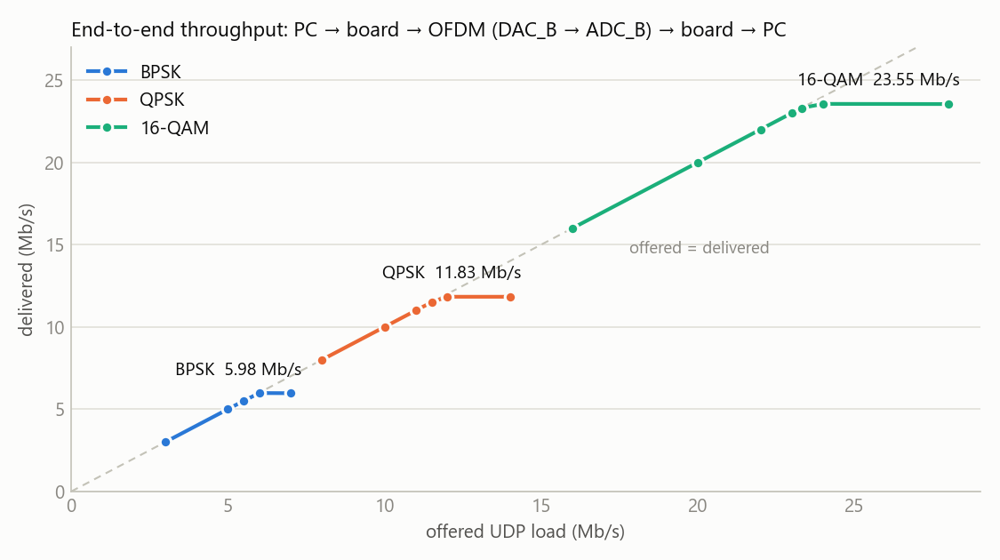
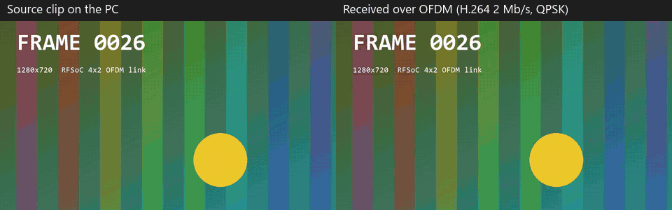

   

[English](#en) | [中文](#cn)

　

<span id="en">RFSoC 4x2 OFDM Compressed Video Link</span>
===========================

Compressed video (H.264 in MPEG-TS) over the Strathclyde [rfsoc_ofdm](https://github.com/strath-sdr/rfsoc_ofdm) transceiver on the RFSoC 4x2: **DAC_B (tile 228 ch0) → SMA loop → ADC_B (tile 226 ch0)**, bare metal, no PYNQ. The PC streams video over UDP, the PS wraps it into CRC-protected link packets, the PL modulates them onto the OFDM carrier, and the received packets go back to the PC for playback.

Measured on the board: **5.98 / 11.83 / 23.55 Mb/s** end to end with BPSK / QPSK / 16-QAM, **EVM −35 dB**, 720p H.264 received bit-exact.

　

|  |
| :--------------------------: |
| **Figure1** : data path      |

　

## Technical Features

* **User data on the strath-sdr PHY**: the HDL Coder `ofdm_tx` only transmits PRBS. `rtl/ofdm_txs/` is the same core with the PRBS source replaced by an external symbol port, fed from an AXI4-Stream FIFO by `ofdm_tx_stream`. `ofdm_rx` is unchanged; `ofdm_rx_demap` slices its equalised sub-carriers (BPSK / QPSK / 16-QAM) and packs bytes.
* **Bit-exact framing**: the TX pipeline never sends the symbol requested at position 45 of each 48-carrier OFDM symbol and the receiver repeats one at position 0 (found in simulation). Both ends skip them, so every OFDM frame carries exactly **5960 data symbols**, byte aligned for all modulations, also after a run-time modulation change.
* **Self-synchronising byte stream**: one DMA packet per OFDM frame; link packets (`1A CF FC 1D`, length, sequence, payload, CRC32) may span frames, a lost frame only loses the packets inside it. Idle slots carry PRBS, so the spectrum does not depend on traffic.
* **Clocks without PYNQ**: LMK04828 (245.76 MHz) and two LMX2594 (491.52 MHz) over PS SPI0 instead of the ZCU208 CLK104 I2C bridge; both tiles on their own PLL at 3.93216 GSPS, ×8 interpolation / decimation, 245.76 MHz fabric clock, 600 MHz carrier.
* **Debug**: System ILA on the receiver symbols and the demapper output, AXI-Lite frame / symbol counters, UART self-test that saturates the link and checks every byte.

　

## Performance Test Results

DAC_B → SMA cable → ADC_B, 600 MHz carrier, 1316-byte packets. End to end = PC → UDP → board → OFDM → board → UDP → PC (`pc/link_test.py`, 8 s per point).

| Modulation | Payload per OFDM frame | End-to-end saturation | Self-test CRC errors | EVM |
| :--------: | :--------------------: | :-------------------: | :------------------: | :---: |
| BPSK       | 745 B                  | **5.98 Mb/s**         | 0 / 5 000            | −34.8 dB |
| QPSK       | 1490 B                 | **11.83 Mb/s**        | 0 / 15 000           | −34.7 dB |
| 16-QAM     | 2980 B                 | **23.55 Mb/s**        | 1 / 20 000           | −35.1 dB |

Below saturation the loss is 0.01–0.04 %; above it the extra load is dropped at the board TX queue, never corrupted. Over 940 k packets the CRC error rate was 1.6 × 10⁻⁴, modulation changes included.

|                       |
| :-----------------------------------------------------------------: |
| **Figure2** : received constellations (ILA at the `ofdm_rx` output) |

|           |
| :-----------------------------------------------: |
| **Figure3** : offered vs delivered UDP throughput |

Video: 20 s of a 720p30 test clip (bars and a moving ball), H.264 at 2 Mb/s over QPSK: 591 / 600 frames decoded, 3 damaged macroblocks; frames without a lost packet are bit-identical to the sent stream. Recorded at a 700 MHz carrier (key `+`): in that session 600 MHz lost about 4 × 10⁻³ of the packets, 700 MHz 1.3 × 10⁻⁴.

|                                                        |
| :---------------------------------------------------------------------------------------: |
| **Figure4** : source clip on the PC (left) and the stream received over the link (right) |

Simulation (`sim/`, TX core → RX core): every frame byte-exact and contiguous for BPSK / QPSK / 16-QAM and across a live 16-QAM → BPSK switch. Implementation (Vivado 2020.2, with the ILA): 27.1 k LUT (6.4 %), 40.5 k FF, 41 BRAM, 191 DSP, WNS +0.251 ns.

　

## Build and Run

Vivado / Vitis 2020.2 (RFSoC 4x2 board files installed):

```
cd boards/RFSoC4x2/ofdm_video
vivado -mode batch -source make_project.tcl -tclargs build     # design_1_wrapper.xsa
xsct sw/create_vitis.tcl                                       # standalone + lwIP, ofdm_video.elf
xsct sw/run_jtag.tcl                                           # bitstream + ELF over JTAG
```

UART1 115200: `t` self-test, `1` / `2` / `4` BPSK / QPSK / 16-QAM, `+` / `-` carrier, `s` counters. After power-on, reload once if errors come in periodic bursts (LMK PLL1 settling).

PC `192.168.1.x`, board `192.168.1.10`, [ffmpeg](https://ffmpeg.org/) on the PATH:

```
pc\play.bat                          # receive UDP 5001
pc\send_video.bat input.mp4 2M       # H.264 / MPEG-TS to UDP 5000
python pc\link_test.py --rate 8      # UDP throughput through the link
python pc\recv_ts.py rx.ts --relay 5002   # record / relay if the firewall blocks ffplay
```

Simulation: `sim\run_sim.bat` then `python sim\check_loop.py`. ILA capture: `vivado -mode batch -source sw/ila_capture.tcl`.

　

## Credits

OFDM transceiver, interpolator, decimator: [strath-sdr/rfsoc_ofdm](https://github.com/strath-sdr/rfsoc_ofdm) (BSD 3-Clause, University of Strathclyde). RFDC startup: Xilinx ZCU208 `dds_ila` example. Clock registers: PYNQ RFSoC4x2 `LMK04828_245.76` / `LMX2594_491.52`, driver from [RFSoC4x2_clock_LMK_LMX](https://github.com/uceeyuf/RFSoC4x2_clock_LMK_LMX). Files in this directory: BSD 3-Clause, Copyright (c) 2026, Yijie Yu.

　

　

<span id="cn">RFSoC 4x2 OFDM 压缩视频传输</span>
===========================

在 RFSoC 4x2 上用 Strathclyde 的 [rfsoc_ofdm](https://github.com/strath-sdr/rfsoc_ofdm) 收发机传输压缩视频（H.264 / MPEG-TS）：**DAC_B（tile 228 ch0）→ SMA 环回 → ADC_B（tile 226 ch0）**，裸机运行，不依赖 PYNQ。PC 通过 UDP 发视频流，PS 封装成带 CRC 的链路包，PL 调制到 OFDM 载波上，收到的包再发回 PC 播放。

上板实测：BPSK / QPSK / 16-QAM 端到端 **5.98 / 11.83 / 23.55 Mb/s**，**EVM −35 dB**，720p H.264 逐比特正确接收。

　

|  |
| :--------------------------: |
| **图1** : 数据通路            |

　

## 技术特点

* **在 strath-sdr PHY 上传用户数据**：HDL Coder 生成的 `ofdm_tx` 只能发 PRBS。`rtl/ofdm_txs/` 是同一个核，只把 PRBS 源换成外部符号端口，由 `ofdm_tx_stream` 从 AXI4-Stream FIFO 取数。`ofdm_rx` 原样使用，`ofdm_rx_demap` 对均衡后的子载波做判决（BPSK / QPSK / 16-QAM）并打包成字节。
* **逐比特对齐的帧结构**：TX 流水线在每个 48 子载波 OFDM 符号的第 45 个位置请求的数据发不出去，接收端在第 0 个位置重复一个符号（仿真中发现）。两端都跳过这两个位置，每个 OFDM 帧正好 **5960 个数据符号**，各种调制下字节对齐，运行时切换调制后也一样。
* **自同步字节流**：每个 OFDM 帧一个 DMA 包；链路包（`1A CF FC 1D`、长度、序号、载荷、CRC32）可以跨帧，丢一帧只丢该帧内的包。空闲时隙填 PRBS，频谱与业务无关。
* **不依赖 PYNQ 的时钟**：LMK04828（245.76 MHz）和两片 LMX2594（491.52 MHz）走 PS SPI0，不同于 ZCU208 CLK104 的 I2C 转 SPI；两个 tile 用各自 PLL，3.93216 GSPS，8 倍插值/抽取，fabric 245.76 MHz，载波 600 MHz。
* **调试**：System ILA 抓接收符号和解映射输出，AXI-Lite 帧/符号计数，串口自测把链路跑满并逐字节校验。

　

## 性能测试结果

DAC_B → SMA 线 → ADC_B，载波 600 MHz，每包 1316 字节。端到端 = PC → UDP → 板卡 → OFDM → 板卡 → UDP → PC（`pc/link_test.py`，每点 8 秒）。

| 调制 | 每 OFDM 帧载荷 | 端到端饱和吞吐 | 自测 CRC 错误 | EVM |
| :--: | :------------: | :------------: | :-----------: | :---: |
| BPSK | 745 B | **5.98 Mb/s** | 0 / 5 000 | −34.8 dB |
| QPSK | 1490 B | **11.83 Mb/s** | 0 / 15 000 | −34.7 dB |
| 16-QAM | 2980 B | **23.55 Mb/s** | 1 / 20 000 | −35.1 dB |

未饱和时丢包 0.01–0.04 %；超出容量的流量在板卡发送队列丢弃，不会出错包。94 万包累计 CRC 错误率 1.6 × 10⁻⁴（含调制切换）。

|        |
| :--------------------------------------------------: |
| **图2** : 接收星座图（ILA，`ofdm_rx` 输出）          |

|  |
| :--------------------------------------: |
| **图3** : UDP 吞吐：发送 vs 交付          |

视频：720p30 测试片（彩条加移动小球）20 秒，H.264 2 Mb/s 走 QPSK：600 帧解出 591 帧，3 个宏块受损；没有丢包的帧与发出的码流逐比特一致。录制时载波为 700 MHz（按 `+`）：那次 600 MHz 的丢包率约 4 × 10⁻³，700 MHz 为 1.3 × 10⁻⁴。

|                     |
| :----------------------------------------------------: |
| **图4** : 左边是 PC 上的原片，右边是经链路收到的码流 |

仿真（`sim/`，TX 核直连 RX 核）：BPSK / QPSK / 16-QAM 及 16-QAM → BPSK 在线切换，每帧逐字节一致且连续。实现（Vivado 2020.2，含 ILA）：27.1 k LUT（6.4 %）、40.5 k FF、41 BRAM、191 DSP，WNS +0.251 ns。

　

## 编译与运行

Vivado / Vitis 2020.2（已安装 RFSoC 4x2 board files）：

```
cd boards/RFSoC4x2/ofdm_video
vivado -mode batch -source make_project.tcl -tclargs build     # design_1_wrapper.xsa
xsct sw/create_vitis.tcl                                       # standalone + lwIP，ofdm_video.elf
xsct sw/run_jtag.tcl                                           # JTAG 下载 bitstream + ELF
```

串口 UART1 115200：`t` 自测，`1` / `2` / `4` 切 BPSK / QPSK / 16-QAM，`+` / `-` 调载波，`s` 看计数。上电后若出现周期性误码突发，重新加载一次（LMK PLL1 稳定问题）。

PC `192.168.1.x`，板卡 `192.168.1.10`，[ffmpeg](https://ffmpeg.org/) 加入 PATH：

```
pc\play.bat                          # 接收 UDP 5001
pc\send_video.bat input.mp4 2M       # H.264 / MPEG-TS 发到 UDP 5000
python pc\link_test.py --rate 8      # 链路 UDP 吞吐测试
python pc\recv_ts.py rx.ts --relay 5002   # 防火墙拦 ffplay 时录制 / 转发
```

仿真：`sim\run_sim.bat` 后运行 `python sim\check_loop.py`。ILA 抓取：`vivado -mode batch -source sw/ila_capture.tcl`。

　

## 致谢

OFDM 收发机、插值器、抽取器：[strath-sdr/rfsoc_ofdm](https://github.com/strath-sdr/rfsoc_ofdm)（BSD 3-Clause，University of Strathclyde）。RFDC 启动流程：Xilinx ZCU208 `dds_ila` 例程。时钟寄存器：PYNQ RFSoC4x2 `LMK04828_245.76` / `LMX2594_491.52`，驱动来自 [RFSoC4x2_clock_LMK_LMX](https://github.com/uceeyuf/RFSoC4x2_clock_LMK_LMX)。本目录文件：BSD 3-Clause，版权所有 (c) 2026 Yijie Yu。
